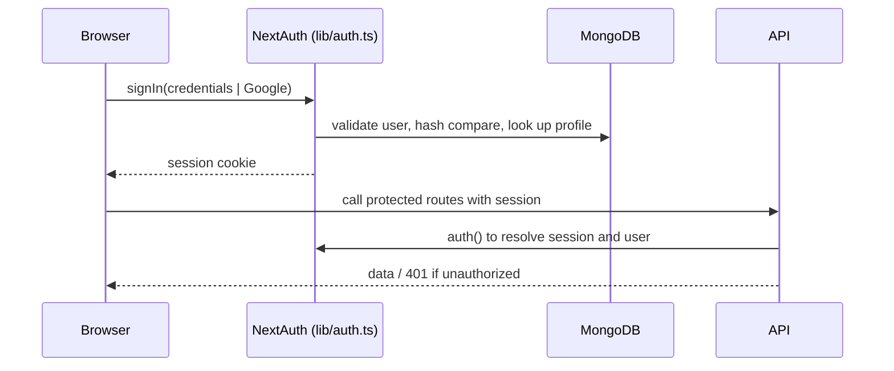
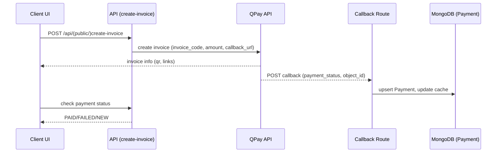

## Architecture

### Directory Structure (selected)

```
app/
  api/                # API routes (App Router)
  admin/              # Admin portal (protected by isAdmin)
  profile/, Course/, Tests/ ...  # User-facing pages
components/           # UI components (shadcn-style primitives under ui/)
lib/                  # Cross-cutting libs (auth, qpay, mongodb, utils)
app/models/           # Mongoose models (User, Course, Test, Payment, Purchase)
docs/                 # Project documentation
```

### Server/Client Boundaries

- Server actions, route handlers, and data access occur in API routes and server components.
- Client components are used for interactive pages (forms, dashboards) and consume server APIs.

### Data Layer

- Connection: `lib/mongodb.ts` provides robust connection handling for Vercel and local.
- Schemas: `app/models/*` define `User`, `Course`, `Test`, `Payment`, and `Purchase`.
- Payment cache: `lib/payment-storage.ts` caches by invoice ID and persists to MongoDB.

### Authentication Flow (NextAuth 5)



### Payment Flow (QPay)



### Cross-Cutting Concerns

- Internationalization: `lib/language.tsx` with EN/MN keys used across admin and user UI.
- Theming: `next-themes` + Tailwind CSS.
- Email: `lib/sendEmail.ts` via SendGrid; templates for verification and reset.
- SMS: `lib/twilio.ts` (optional) for phone verification.

### Admin Access Control

- `app/admin/layout.tsx` enforces `auth()` and `user.isAdmin`, redirecting non-admins.
- Admin navigation via `components/AdminSidebarNav.tsx` and `components/LogoutButton.tsx` with a home link consistent with site styling.


